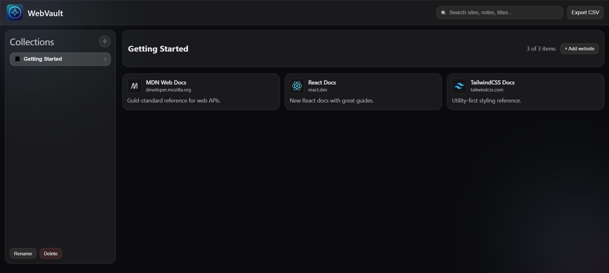
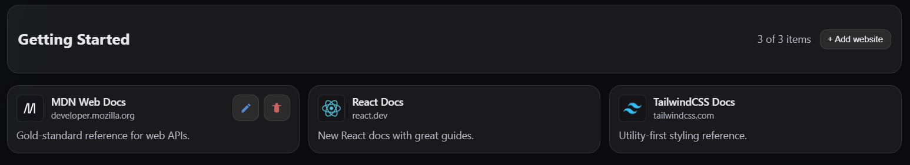
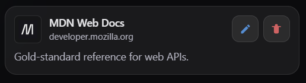

# 🌐 WebVault

> **Save and organize your favorite websites with notes — all in one place.**  
> A clean, minimal browser extension that helps you create personal collections of useful sites, export them as CSV, and stay organized with a simple dark aesthetic UI.

---

## 🧩 Features

- 🗂 **Collections:** Group websites into folders (create, rename, delete).
- 🌐 **Auto Favicon:** Fetches each site’s icon automatically.
- 📝 **Notes:** Add personal notes to every saved website.
- 🔍 **Search Bar:** Instantly filter through all your saved links.
- 🧱 **Fixed Layout:** Persistent topbar & sidebar with scrollable collections.
- ⚙️ **CSV Export:** Export all saved data with one click.
- 💾 **Local Storage:** Everything is stored locally via `chrome.storage.local`.
- 🌓 **Dark Theme + Glass Prism Effect:** A sleek, distraction-free experience.

---

## 🚀 Installation (for Developers / Manual Load)

1. **Download** or **clone** this repository:
   ```bash
   git clone https://github.com/your-username/webvault.git
   ```
   or [Download ZIP](#) and extract it.

2. **Open Chrome Extensions** page:
   ```
   chrome://extensions
   ```

3. Toggle **Developer Mode** (top-right corner).

4. Click **Load Unpacked** and select the project folder (where `manifest.json` is located).

5. Once loaded, you’ll see the **WebVault** icon in your browser toolbar.  
   Click it to open your dashboard.

---

## 🧠 How to Use

1. **Create a Collection**  
   Click `+ New` in the sidebar to make your first collection.

2. **Add a Website**  
   Open the collection → click **Add Website** → enter the URL, title, and optional note.  
   The favicon loads automatically!

3. **Manage**  
   - ✏ Edit → change title, URL, or note.  
   - ❌ Delete → instantly removes a site (no alert).

4. **Search & Filter**  
   Use the topbar search box to quickly find any site or note.

5. **Export CSV**  
   Click **⬇ Export CSV** (topbar) to download all your saved data in `.csv` format.

---

## 📂 Project Structure

```
webvault/
│
├── manifest.json        # Chrome extension config
├── bg.js                # Background service worker
├── dashboard.html       # Main UI
├── styles.css           # Glass + dark theme
├── app.js               # Core logic & storage
└── icons/               # Extension icons (16–128px)
```

---

## 🧱 Tech Stack

- **Manifest V3 (Chrome Extensions API)**
- **HTML + CSS + Vanilla JS**
- **chrome.storage.local** for persistence
- **DuckDuckGo Icons API** for favicons

---

## 🖼️ Screenshots

| Dashboard | Collections | Cards |
|------------|--------------|-------|
|  |  |  |


---

## 💡 Tips

- Use **Export CSV** regularly to back up your collections.
- Works best on Chromium-based browsers (Chrome, Edge, Brave, Arc).

---

## 🤝 Contributing

Pull requests are welcome!  
If you’d like to add new features (like sync, tags, or drag-drop reordering), fork the repo and submit your improvements.

---

## 📜 License

MIT License © 2025 [Your Name or Organization]

---

### 🧭 “Your web, your vault — organized beautifully.”
